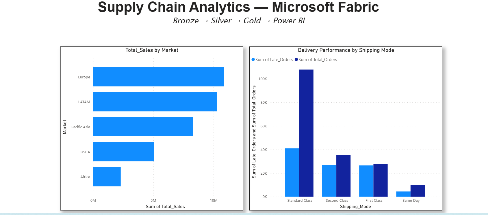

# Microsoft Fabric — Medallion Architecture

## Architecture
Raw CSV → Bronze → Silver → Gold → Power BI

## Layers
**Bronze:** Raw DataCoSupplyChainDataset.csv stored in OneLake

**Silver:** Cleaned Delta table using PySpark
- Removed spaces from column names
- Fixed date columns to proper timestamps
- Dropped unnecessary columns (Password, Description, Image)
- 180,519 rows, 50 columns

**Gold:** Aggregated business tables
- gold_sales_by_market — revenue and profit by region
- gold_delivery_by_shipping — late delivery analysis

## Tools Used
- Microsoft Fabric Lakehouse
- PySpark (Python)
- Delta tables
- SQL analytics endpoint
- Power BI (Direct Lake SQL)

## Key Findings
- Europe leads with 10.8M in total sales
- First Class shipping has highest late delivery rate
- Standard Class most reliable shipping mode
## Dashboard Preview

